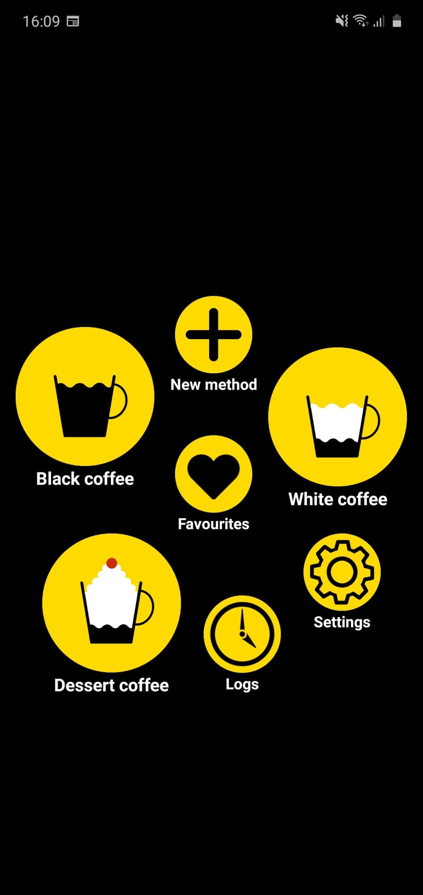
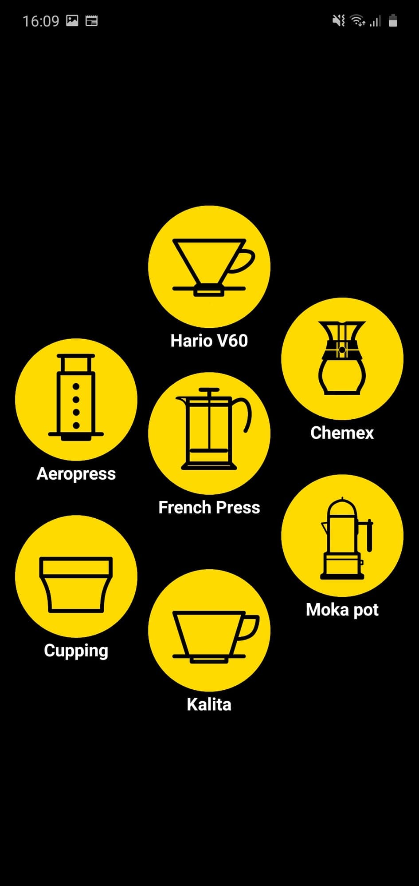
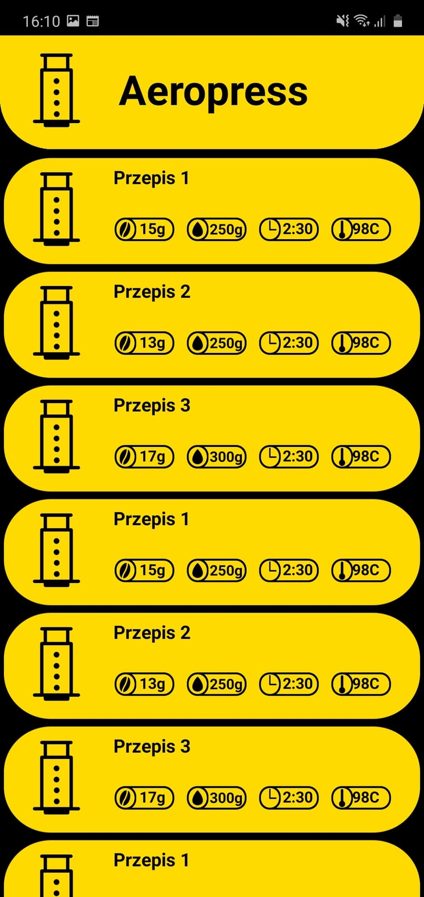

[In progress]
## Table of contents
* [General info](#general-info)
* [Technologies](#technologies)
* [Screenshots](#screenshots)

## General info
Android app which will help you in complex process of preparing speciality coffee.
	
## Technologies
Project is created with:
* Android Java
* SQLite

## Screenshots

* App's homescreen

* Alternative coffee brewing method's select screen

* Method's recipes select screen

* Current method screen
